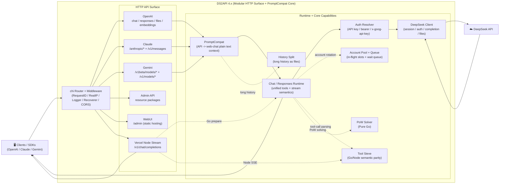

<p align="center">
  
</p>

# DS2API

<a href="https://trendshift.io/repositories/24508" target="_blank"></a>

[](LICENSE)


[](https://github.com/CJackHwang/ds2api/releases)
[](docs/DEPLOY.en.md)
[](https://zeabur.com/templates/L4CFHP)
[](https://vercel.com/new/clone?repository-url=https://github.com/CJackHwang/ds2api)

Language: [中文](README.MD) | [English](README.en.md)

DS2API converts DeepSeek Web chat capability into OpenAI-compatible, Claude-compatible, and Gemini-compatible APIs. The backend is a **pure Go implementation**, with a React WebUI admin panel (source in `webui/`, build output auto-generated to `static/admin` during deployment).

Documentation entry: [Docs Index](docs/README.md) / [Architecture](docs/ARCHITECTURE.en.md) / [API Reference](API.en.md)

> **Important Disclaimer**
>
> This repository is provided for learning, research, personal experimentation, and internal validation only. It does not grant any commercial authorization and comes with no warranty of fitness, stability, or results.
>
> The author and repository maintainers are not responsible for any direct or indirect loss, account suspension, data loss, legal risk, or third-party claims arising from use, modification, distribution, deployment, or reliance on this project.
>
> Do not use this project in ways that violate service terms, agreements, laws, or platform rules. Before any commercial use, review the `LICENSE`, the relevant terms, and confirm that you have the author's written permission.

## Architecture Overview (Summary)



For the full module-by-module architecture and directory responsibilities, see [docs/ARCHITECTURE.en.md](docs/ARCHITECTURE.en.md).

- **Backend**: Go (`cmd/ds2api/`, `api/`, `internal/`), no Python runtime
- **Frontend**: React admin panel (`webui/`), served as static build at runtime
- **Deployment**: local run, Docker, Vercel serverless, Linux systemd

## Key Capabilities

| Capability | Details |
| --- | --- |
| OpenAI compatible | `GET /v1/models`, `GET /v1/models/{id}`, `POST /v1/chat/completions`, `POST /v1/responses`, `GET /v1/responses/{response_id}`, `POST /v1/embeddings`, `POST /v1/files` |
| Claude compatible | `GET /anthropic/v1/models`, `POST /anthropic/v1/messages`, `POST /anthropic/v1/messages/count_tokens` (plus shortcut paths `/v1/messages`, `/messages`) |
| Gemini compatible | `POST /v1beta/models/{model}:generateContent`, `POST /v1beta/models/{model}:streamGenerateContent` (plus `/v1/models/{model}:*` paths) |
| Unified CORS compatibility | `/v1/*`, `/anthropic/*`, `/v1beta/models/*`, and `/admin/*` share one CORS policy; on Vercel, the Node Runtime for `/v1/chat/completions` mirrors the same relaxed preflight behavior for third-party clients |
| Multi-account rotation | Auto token refresh, email/mobile dual login |
| Concurrency control | Per-account in-flight limit + waiting queue, dynamic recommended concurrency |
| DeepSeek PoW | Pure Go high-performance solver (DeepSeekHashV1), ms-level response |
| Tool Calling | Anti-leak handling: non-code-block feature match, early `delta.tool_calls`, structured incremental output |
| Admin API | Config management, runtime settings hot-reload, proxy management, account testing/batch test, session cleanup, import/export, Vercel sync, version check |
| WebUI Admin Panel | SPA at `/admin` (bilingual Chinese/English, dark mode, with server-side conversation history) |
| Health Probes | `GET /healthz` (liveness), `GET /readyz` (readiness) |

## Platform Compatibility Matrix

| Tier | Platform | Status |
| --- | --- | --- |
| P0 | Codex CLI/SDK (`wire_api=chat` / `wire_api=responses`) | ✅ |
| P0 | OpenAI SDK (JS/Python, chat + responses) | ✅ |
| P0 | Vercel AI SDK (openai-compatible) | ✅ |
| P0 | Anthropic SDK (messages) | ✅ |
| P0 | Google Gemini SDK (generateContent) | ✅ |
| P1 | LangChain / LlamaIndex / OpenWebUI (OpenAI-compatible integration) | ✅ |

## Model Support

### OpenAI Endpoint (`GET /v1/models`)

| Family | Model ID | thinking | search |
| --- | --- | --- | --- |
| default | `deepseek-v4-flash` | enabled by default, request-controlled | ❌ |
| expert | `deepseek-v4-pro` | enabled by default, request-controlled | ❌ |
| default | `deepseek-v4-flash-search` | enabled by default, request-controlled | ✅ |
| expert | `deepseek-v4-pro-search` | enabled by default, request-controlled | ✅ |
| vision | `deepseek-v4-vision` | enabled by default, request-controlled | ❌ |
| vision | `deepseek-v4-vision-search` | enabled by default, request-controlled | ✅ |

Besides native IDs, DS2API also accepts common aliases as input (for example `gpt-4.1`, `gpt-5`, `gpt-5-codex`, `o3`, `claude-*`, `gemini-*`), but `/v1/models` returns normalized DeepSeek native model IDs. The complete alias behavior is documented in [API.en.md](API.en.md#model-alias-resolution) and `config.example.json`.

### Claude Endpoint (`GET /anthropic/v1/models`)

| Current common model | Default Mapping |
| --- | --- |
| `claude-sonnet-4-6` | `deepseek-v4-flash` |
| `claude-haiku-4-5` (compatible with `claude-3-5-haiku-latest`) | `deepseek-v4-flash` |
| `claude-opus-4-6` | `deepseek-v4-pro` |

Override mapping via the global `model_aliases` config.
Besides the primary aliases above, `/anthropic/v1/models` also returns Claude 4.x snapshots plus historical 3.x IDs and common aliases for legacy client compatibility.

#### Claude Code integration pitfalls (validated)

- Set `ANTHROPIC_BASE_URL` to the DS2API root URL (for example `http://127.0.0.1:5001`). Claude Code sends requests to `/v1/messages?beta=true`.
- `ANTHROPIC_API_KEY` must match an entry in `keys` from `config.json`. Keeping both a regular key and an `sk-ant-*` style key improves client compatibility.
- If your environment has proxy variables, set `NO_PROXY=127.0.0.1,localhost,<your_host_ip>` for DS2API to avoid proxy interception of local traffic.
- If tool calls are rendered as plain text and not executed, first verify the model output uses the recommended DSML block: `<|DSML|tool_calls><|DSML|invoke name="..."><|DSML|parameter name="...">...`. DS2API also accepts legacy canonical XML: `<tool_calls><invoke name="..."><parameter name="...">...`; legacy `<tools>` / `<tool_call>` / `<tool_name>` / `<param>`, `<function_call>`, `tool_use`, or standalone JSON `tool_calls` are not executed.

### Gemini Endpoint

The Gemini adapter maps model names to DeepSeek native models via `model_aliases` or built-in heuristics, supporting both `generateContent` and `streamGenerateContent` call patterns with full Tool Calling support (`functionDeclarations` → `functionCall` output).

## Quick Start

### Recommended deployment priority

Recommended order when choosing a deployment method:

1. **Download and run release binaries**: the easiest path for most users because the artifacts are already built.
2. **Docker / GHCR image deployment**: suitable for containerized, orchestrated, or cloud environments.
3. **Vercel deployment**: suitable if you already use Vercel and accept its platform constraints.
4. **Run from source / build locally**: suitable for development, debugging, or when you need to modify the code yourself.

### Universal First Step (all deployment modes)

Use `config.json` as the single source of truth (recommended):

```bash
cp config.example.json config.json
# Edit config.json
```

Recommended per deployment mode:
- Local run: read `config.json` directly
- Docker / Vercel: generate Base64 from `config.json` and inject as `DS2API_CONFIG_JSON`, or paste raw JSON directly

The WebUI admin panel’s “Full configuration template” is loaded from the same `config.example.json`, so updating that file keeps the frontend template in sync.

### Option 1: Download Release Binaries

GitHub Actions automatically builds multi-platform archives on each Release:

```bash
# After downloading the archive for your platform
tar -xzf ds2api_<tag>_linux_amd64.tar.gz
cd ds2api_<tag>_linux_amd64
cp config.example.json config.json
# Edit config.json
./ds2api
```

### Option 2: Docker / GHCR

```bash
# Pull prebuilt image
docker pull ghcr.io/cjackhwang/ds2api:latest

# Or run a pinned version
# docker pull ghcr.io/cjackhwang/ds2api:v3.0.0

# Prepare env file and config file
cp .env.example .env
cp config.example.json config.json

# Start with compose
docker-compose up -d
```

The default `docker-compose.yml` uses `ghcr.io/cjackhwang/ds2api:latest`, maps host port `6011` to container port `5001`, and mounts `./config.json:/app/config.json` plus `./data:/app/data`. Account stats default to `/app/data/account_stats/`, and runtime tokens default to `/app/data/account_tokens/` without being written to `config.json`. If you want `5001` exposed directly, set `DS2API_HOST_PORT=5001` (or adjust the `ports` mapping).

Rebuild after updates: `docker-compose up -d --build`

#### Zeabur One-Click (Dockerfile)

1. Click the “Deploy on Zeabur” button above to deploy.
2. After deployment, open `/admin` and login with `DS2API_ADMIN_KEY` shown in Zeabur env/template instructions.
3. Import / edit config in Admin UI (it will be written and persisted to `/data/config.json`).

Note: when Zeabur builds directly from the repo `Dockerfile`, you do not need to pass `BUILD_VERSION`. The image prefers that build arg when provided, and automatically falls back to the repo-root `VERSION` file when it is absent.

### Option 3: Vercel

1. Fork this repo to your GitHub account
2. Import the project on Vercel
3. Set environment variables (minimum: `DS2API_ADMIN_KEY`; recommended to also set `DS2API_CONFIG_JSON`)
4. Deploy

Recommended first step in repo root:

```bash
cp config.example.json config.json
# Edit config.json
```

Recommended: convert `config.json` to Base64 locally, then paste into `DS2API_CONFIG_JSON` to avoid JSON formatting mistakes:

```bash
base64 < config.json | tr -d '\n'
```

> **Streaming note**: `/v1/chat/completions` on Vercel is routed to `api/chat-stream.js` (Node Runtime) for real-time SSE. Auth, account selection, and session/PoW preparation are still handled by the Go internal prepare endpoint; streaming output (including `tools`) is assembled on Node with Go-aligned anti-leak handling. This is the only interface family currently routed through Node, and its CORS allow behavior is kept aligned with the Go router so third-party preflight handling stays unified.

For detailed deployment instructions, see the [Deployment Guide](docs/DEPLOY.en.md).

### Option 4: Local Run

**Prerequisites**: Go 1.26+, Node.js `20.19+` or `22.12+` (only if building WebUI locally)

```bash
# 1. Clone
git clone https://github.com/CJackHwang/ds2api.git
cd ds2api

# 2. Configure
cp config.example.json config.json
# Edit config.json with your DeepSeek account info and API keys

# 3. Start
go run ./cmd/ds2api
```

Default local URL: `http://127.0.0.1:5001`

The server actually binds to `0.0.0.0:5001`, so devices on the same LAN can usually reach it through your private IP as well.

> **WebUI auto-build**: On first local startup, if `static/admin` is missing, DS2API will auto-run `npm ci` (only when dependencies are missing) and `npm run build -- --outDir static/admin --emptyOutDir` (requires Node.js). You can also build manually: `./scripts/build-webui.sh`

## Configuration

`README` keeps only the onboarding path. Use [config.example.json](config.example.json) as the field template, and see the [deployment guide](docs/DEPLOY.en.md#0-prerequisites) plus [API configuration notes](API.en.md#configuration-best-practice) for full details.

Common fields:

- `keys` / `api_keys`: client API keys; `api_keys` adds `name` and `remark` metadata while `keys` remains compatible.
- `accounts`: managed DeepSeek accounts, supporting `email` or `mobile` login plus proxy/name/remark metadata and an optional `device_id`.
- `model_aliases`: one shared alias map for OpenAI / Claude / Gemini model names.
- `runtime`: account concurrency, queueing, and token refresh behavior, hot-reloadable via Admin Settings.
- `auto_delete.mode`: remote session cleanup after each request, supporting `none` / `single` / `all`.
- `history_split`: legacy multi-turn history split field, now ignored and kept only for backward-compatible config loading.
- `current_input_file`: the only active split mode; it is enabled by default and uploads the full context as a hidden context file once the character threshold is reached.
- If you turn off `current_input_file`, requests pass through directly without uploading any split context file.

For the full environment variable list, see [docs/DEPLOY.en.md](docs/DEPLOY.en.md). For auth behavior, see [API.en.md](API.en.md#authentication).

## Authentication Modes

For business endpoints (`/v1/*`, `/anthropic/*`, Gemini routes), DS2API supports two modes:

| Mode | Description |
| --- | --- |
| **Managed account** | Use a key from `config.keys` via `Authorization: Bearer ...` or `x-api-key`; DS2API auto-selects an account |
| **Direct token** | If the token is not in `config.keys`, DS2API treats it as a DeepSeek token directly |

Optional header `X-Ds2-Target-Account`: Pin a specific managed account (value is email or mobile).
Gemini routes also accept `x-goog-api-key`, or `?key=` / `?api_key=` when no auth header is present.

## Concurrency Model

```
Per-account inflight = DS2API_ACCOUNT_MAX_INFLIGHT (default 2)
Recommended concurrency = account_count × per_account_inflight
Queue limit = DS2API_ACCOUNT_MAX_QUEUE (default = recommended concurrency)
429 threshold = inflight + queue ≈ account_count × 4
```

- When inflight slots are full, requests enter a waiting queue — **no immediate 429**
- 429 is returned only when total load exceeds inflight + queue capacity
- `GET /admin/queue/status` returns real-time concurrency state

## Tool Call Adaptation

When `tools` is present in the request, DS2API performs anti-leak handling:

1. Toolcall feature matching is enabled only in **non-code-block context** (fenced examples are ignored)
2. The parser now treats the DSML shell as the recommended executable tool-calling syntax: `<|DSML|tool_calls>` → `<|DSML|invoke name="...">` → `<|DSML|parameter name="...">`; it also accepts legacy canonical XML `<tool_calls>` → `<invoke name="...">` → `<parameter name="...">`. DSML is a shell alias and internal parsing remains XML-based; legacy `<tools>` / `<tool_call>` / `<tool_name>` / `<param>`, `<function_call>`, `tool_use`, antml variants, and standalone JSON `tool_calls` payloads are treated as plain text
3. `responses` streaming strictly uses official item lifecycle events (`response.output_item.*`, `response.content_part.*`, `response.function_call_arguments.*`)
4. `responses` supports and enforces `tool_choice` (`auto`/`none`/`required`/forced function); `required` violations return `422` for non-stream and `response.failed` for stream
5. The output protocol follows the client request (OpenAI / Claude / Gemini native shapes); model-side prompting can prefer XML, and the compatibility layer handles the protocol-specific translation

> Note: the current parser still prioritizes “parse successfully whenever possible”; hard allow-list rejection for undeclared tool names is not enabled yet.

## Local Dev Packet Capture

This is for debugging issues such as Responses reasoning streaming and tool-call handoff. When enabled, DS2API stores the latest N DeepSeek conversation payload pairs (request body + upstream response body), defaulting to 20 entries with auto-eviction; each response body is capped at 5 MB by default.

Enable example:

```bash
DS2API_DEV_PACKET_CAPTURE=true \
DS2API_DEV_PACKET_CAPTURE_LIMIT=20 \
go run ./cmd/ds2api
```

Inspect/clear (Admin JWT required):

- `GET /admin/dev/captures`: list captured items (newest first)
- `DELETE /admin/dev/captures`: clear captured items
- `GET /admin/dev/raw-samples/query?q=keyword&limit=20`: search current in-memory captures by prompt keyword and group `completion + continue` by `chat_session_id`
- `POST /admin/dev/raw-samples/save`: persist a selected capture chain as `tests/raw_stream_samples/<sample-id>/`

Response fields include:

- `request_body`: full payload sent to DeepSeek
- `response_body`: concatenated raw upstream stream body text
- `response_truncated`: whether body-size truncation happened

The save endpoint can target a chain by `query`, `chain_key`, or `capture_id`. Example:

```json
{"query":"Guangzhou weather","sample_id":"gz-weather-from-memory"}
```

## Documentation Index

| Document | Description |
| --- | --- |
| [API.md](API.md) / [API.en.md](API.en.md) | API reference with request/response examples |
| [DEPLOY.md](docs/DEPLOY.md) / [DEPLOY.en.md](docs/DEPLOY.en.md) | Deployment guide (local/Docker/Vercel/systemd) |
| [CONTRIBUTING.md](docs/CONTRIBUTING.md) / [CONTRIBUTING.en.md](docs/CONTRIBUTING.en.md) | Contributing guide |
| [TESTING.md](docs/TESTING.md) | Testsuite guide |

## Testing

For the full testing guide, see [docs/TESTING.md](docs/TESTING.md).

Quick commands:

```bash
# Local PR gates
./scripts/lint.sh
./tests/scripts/check-refactor-line-gate.sh
./tests/scripts/run-unit-all.sh
npm run build --prefix webui

# Live end-to-end tests (real accounts, full request/response logs)
./tests/scripts/run-live.sh
```

## Release Artifact Automation (GitHub Actions)

Workflow: `.github/workflows/release-artifacts.yml`

- **Trigger**: GitHub Release `published`, pushed tags matching `v*`, or manual dispatch (normal branch pushes do not trigger builds)
- **Outputs**: multi-platform archives (`linux/amd64`, `linux/arm64`, `linux/armv7`, `darwin/amd64`, `darwin/arm64`, `windows/amd64`, `windows/arm64`) + `sha256sums.txt`
- **Container publishing**: GHCR only (`ghcr.io/cjackhwang/ds2api`)
- **Each archive includes**: `ds2api` executable, `static/admin`, WASM file (with embedded fallback support), `config.example.json`-based config template, README, LICENSE

## Disclaimer

This project is built through reverse engineering and is provided for learning, research, personal experimentation, and internal validation only. No commercial authorization is granted, and no warranty of stability, fitness, or results is provided.
The author and repository maintainers are not responsible for any direct or indirect loss, account suspension, data loss, legal risk, or third-party claims arising from use, modification, distribution, deployment, or reliance on this project.

Do not use this project in ways that violate service terms, agreements, laws, or platform rules. Before any commercial use, review the `LICENSE`, the relevant terms, and confirm that you have the author's written permission.
