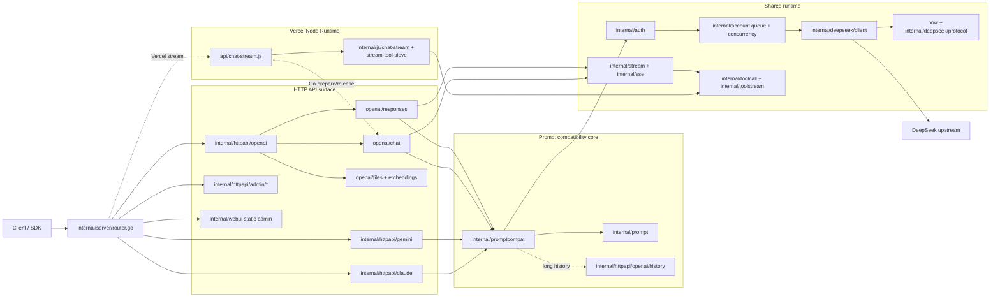

# DS2API Architecture & Project Layout

Language: [中文](ARCHITECTURE.md) | [English](ARCHITECTURE.en.md)

> This file is the single architecture source for directory layout, module boundaries, and execution flow.

## 1. Top-level Layout (core directories)

> Notes: this lists the main business directories (excluding metadata/dependency dirs such as `.git/` and `webui/node_modules/`), with each folder annotated by purpose. Newly added directories should be verified from the code tree rather than treated as a per-file inventory here.

```text
ds2api/
├── .github/                              # GitHub collaboration and CI config
│   ├── ISSUE_TEMPLATE/                   # Issue templates
│   └── workflows/                        # GitHub Actions workflows
├── api/                                  # Serverless entrypoints (Vercel Go/Node)
├── app/                                  # Application-level handler assembly
├── cmd/                                  # Executable entrypoints
│   ├── ds2api/                           # Main service bootstrap
│   └── ds2api-tests/                     # E2E testsuite CLI bootstrap
├── docs/                                 # Project documentation
├── internal/                             # Core implementation (non-public packages)
│   ├── account/                          # Account pool, inflight slots, waiting queue
│   ├── auth/                             # Auth/JWT/credential resolution
│   ├── chathistory/                      # Server-side conversation history storage/query
│   ├── claudeconv/                       # Claude message conversion helpers
│   ├── compat/                           # Compatibility and regression helpers
│   ├── config/                           # Config loading/validation/hot reload
│   ├── deepseek/                         # DeepSeek upstream client/protocol/transport
│   │   ├── client/                       # Login/session/completion/upload/delete calls
│   │   ├── protocol/                     # DeepSeek URLs, constants, skip path/pattern
│   │   └── transport/                    # DeepSeek transport details
│   ├── devcapture/                       # Dev capture and troubleshooting
│   ├── format/                           # Response formatting layer
│   │   ├── claude/                       # Claude output formatting
│   │   └── openai/                       # OpenAI output formatting
│   ├── httpapi/                          # HTTP surfaces: OpenAI/Claude/Gemini/Admin
│   │   ├── admin/                        # Admin API root assembly and resource packages
│   │   ├── claude/                       # Claude HTTP protocol adapter
│   │   ├── gemini/                       # Gemini HTTP protocol adapter
│   │   └── openai/                       # OpenAI HTTP surface
│   │       ├── chat/                     # Chat Completions execution entrypoint
│   │       ├── responses/                # Responses API and response store
│   │       ├── files/                    # Files API and inline-file preprocessing
│   │       ├── embeddings/               # Embeddings API
│   │       ├── history/                  # OpenAI context file handling
│   │       └── shared/                   # OpenAI HTTP errors/models/tool formatting
│   ├── js/                               # Node runtime related logic
│   │   ├── chat-stream/                  # Node streaming bridge
│   │   ├── helpers/                      # JS helper modules
│   │   │   └── stream-tool-sieve/        # JS implementation of tool sieve
│   │   └── shared/                       # Shared semantics between Go/Node
│   ├── prompt/                           # Prompt composition
│   ├── promptcompat/                     # API request -> DeepSeek web-chat plain-text compatibility
│   ├── rawsample/                        # Raw sample read/write and management
│   ├── server/                           # Router and middleware assembly
│   │   └── data/                         # Router/runtime helper data
│   ├── sse/                              # SSE parsing utilities
│   ├── stream/                           # Unified stream consumption engine
│   ├── testsuite/                        # Testsuite execution framework
│   ├── textclean/                        # Text cleanup
│   ├── toolcall/                         # Tool-call parsing and repair
│   ├── toolstream/                       # Go streaming tool-call anti-leak and delta detection
│   ├── translatorcliproxy/               # Cross-protocol translation bridge
│   ├── util/                             # Shared utility helpers
│   ├── version/                          # Version query/compare
│   └── webui/                            # WebUI static hosting logic
├── plans/                                # Stage plans and manual QA records
├── pow/                                  # PoW standalone implementation + benchmarks
├── scripts/                              # Build/release helper scripts
├── tests/                                # Test assets and scripts
│   ├── compat/                           # Compatibility fixtures + expected outputs
│   │   ├── expected/                     # Expected output samples
│   │   └── fixtures/                     # Fixture inputs
│   │       ├── sse_chunks/               # SSE chunk fixtures
│   │       └── toolcalls/                # Tool-call fixtures
│   ├── node/                             # Node unit tests
│   ├── raw_stream_samples/               # Upstream raw SSE samples
│   │   ├── content-filter-trigger-20260405-jwt3/          # Content-filter terminal sample
│   │   ├── continue-thinking-snapshot-replay-20260405/    # Continue-thinking sample
│   │   ├── guangzhou-weather-reasoner-search-20260404/    # Search/reference sample
│   │   ├── markdown-format-example-20260405/              # Markdown sample
│   │   └── markdown-format-example-20260405-spacefix/     # Space-fix sample
│   ├── scripts/                          # Test entry scripts
│   └── tools/                            # Testing helper tools
└── webui/                                # React admin console source
    ├── public/                           # Static assets
    └── src/                              # Frontend source code
        ├── app/                          # Routing/state scaffolding
        ├── components/                   # Shared UI components
        ├── features/                     # Feature modules
        │   ├── account/                  # Account management page
        │   ├── apiTester/                # API tester page
        │   ├── settings/                 # Settings page
        │   └── vercel/                   # Vercel sync page
        ├── layout/                       # Layout components
        ├── locales/                      # i18n strings
        └── utils/                        # Frontend utilities
```

## 2. Primary Request Flow



## 3. Responsibilities in `internal/`

- `internal/server`: router tree + middlewares (health, protocol routes, Admin/WebUI).
- `internal/httpapi/openai/*`: OpenAI HTTP surface split into chat, responses, files, embeddings, history, and shared packages; chat/responses share the promptcompat, stream, and toolcall semantics.
- `internal/httpapi/{claude,gemini}`: protocol wrappers that normalize into the same prompt compatibility semantics without duplicating upstream execution.
- `internal/promptcompat`: compatibility core for turning OpenAI/Claude/Gemini requests into DeepSeek web-chat plain-text context.
- `internal/translatorcliproxy`: structure translation between Claude/Gemini and OpenAI.
- `internal/deepseek/{client,protocol,transport}`: upstream requests, sessions, PoW adaptation, protocol constants, and transport details.
- `internal/js/chat-stream` + `api/chat-stream.js`: Vercel Node streaming bridge; Go prepare/release owns auth, account lease, and completion payload assembly, while Node relays real-time SSE with Go-aligned finalization and tool sieve semantics.
- `internal/stream` + `internal/sse`: Go stream parsing and incremental assembly.
- `internal/toolcall` + `internal/toolstream`: DSML shell compatibility plus canonical XML tool-call parsing and anti-leak sieve; DSML is normalized back to XML at the entrypoint, and internal parsing remains XML-based.
- `internal/httpapi/admin/*`: Admin API root assembly plus auth/accounts/config/settings/proxies/rawsamples/vercel/history/devcapture/version resource packages.
- `internal/chathistory`: server-side conversation history persistence, pagination, detail lookup, and retention policy.
- `internal/config`: config loading/validation + runtime settings hot-reload.
- `internal/account`: managed account pool, inflight slots, waiting queue.

## 4. WebUI Runtime Relation

- `webui/` stores frontend source (Vite + React).
- Runtime serves static output from `static/admin`.
- On first local startup, if `static/admin` is missing, DS2API may auto-build it (Node.js required).

## 5. Documentation Split Strategy

- Onboarding & quick start: `README.MD` / `README.en.md`
- Architecture & layout: `docs/ARCHITECTURE*.md` (this file)
- API contracts: `API.md` / `API.en.md`
- Deployment/testing/contributing: `docs/DEPLOY*`, `docs/TESTING.md`, `docs/CONTRIBUTING*`
- Deep topics: `docs/toolcall-semantics.md`, `docs/DeepSeekSSE行为结构说明-2026-04-05.md`
