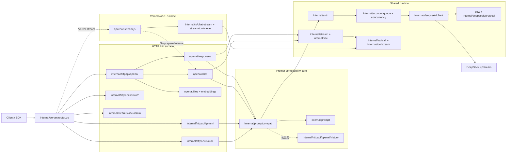

# DS2API 架构与项目结构说明

语言 / Language: [中文](ARCHITECTURE.md) | [English](ARCHITECTURE.en.md)

> 本文档用于集中维护“代码目录结构 + 模块边界 + 主链路调用关系”。

## 1. 顶层目录结构（核心目录）

> 说明：以下为仓库内主要业务目录（排除 `.git/` 与 `webui/node_modules/` 这类依赖/元数据目录），并标注每个文件夹作用。新增目录以代码为准，不要求在本文做逐文件展开。

```text
ds2api/
├── .github/                              # GitHub 协作与 CI 配置
│   ├── ISSUE_TEMPLATE/                   # Issue 模板
│   └── workflows/                        # GitHub Actions 工作流
├── api/                                  # Serverless 入口（Vercel Go/Node）
├── app/                                  # 应用级 handler 装配层
├── cmd/                                  # 可执行程序入口
│   ├── ds2api/                           # 主服务启动入口
│   └── ds2api-tests/                     # E2E 测试集 CLI 入口
├── docs/                                 # 项目文档目录
├── internal/                             # 核心业务实现（不对外暴露）
│   ├── account/                          # 账号池、并发槽位、等待队列
│   ├── auth/                             # 鉴权/JWT/凭证解析
│   ├── chathistory/                      # 服务器端对话记录存储与查询
│   ├── claudeconv/                       # Claude 消息格式转换工具
│   ├── compat/                           # 兼容性辅助与回归支持
│   ├── config/                           # 配置加载、校验、热更新
│   ├── deepseek/                         # DeepSeek 上游 client/protocol/transport
│   │   ├── client/                       # 登录、会话、completion、上传/删除等上游调用
│   │   ├── protocol/                     # DeepSeek URL、常量、skip path/pattern
│   │   └── transport/                    # DeepSeek 传输层细节
│   ├── devcapture/                       # 开发抓包与调试采集
│   ├── format/                           # 响应格式化层
│   │   ├── claude/                       # Claude 输出格式化
│   │   └── openai/                       # OpenAI 输出格式化
│   ├── httpapi/                          # HTTP surface：OpenAI/Claude/Gemini/Admin
│   │   ├── admin/                        # Admin API 根装配与资源子包
│   │   ├── claude/                       # Claude HTTP 协议适配
│   │   ├── gemini/                       # Gemini HTTP 协议适配
│   │   └── openai/                       # OpenAI HTTP surface
│   │       ├── chat/                     # Chat Completions 执行入口
│   │       ├── responses/                # Responses API 与 response store
│   │       ├── files/                    # Files API 与 inline file 预处理
│   │       ├── embeddings/               # Embeddings API
│   │       ├── history/                  # OpenAI context file handling
│   │       └── shared/                   # OpenAI HTTP 公共错误/模型/工具格式
│   ├── js/                               # Node Runtime 相关逻辑
│   │   ├── chat-stream/                  # Node 流式输出桥接
│   │   ├── helpers/                      # JS 辅助函数
│   │   │   └── stream-tool-sieve/        # Tool sieve JS 实现
│   │   └── shared/                       # Go/Node 共用语义片段
│   ├── prompt/                           # Prompt 组装
│   ├── promptcompat/                     # API 请求到 DeepSeek 网页纯文本上下文兼容层
│   ├── rawsample/                        # raw sample 读写与管理
│   ├── server/                           # 路由与中间件装配
│   │   └── data/                         # 路由/运行时辅助数据
│   ├── sse/                              # SSE 解析工具
│   ├── stream/                           # 统一流式消费引擎
│   ├── testsuite/                        # 测试集执行框架
│   ├── textclean/                        # 文本清洗
│   ├── toolcall/                         # 工具调用解析与修复
│   ├── toolstream/                       # Go 流式 tool call 防泄漏与增量检测
│   ├── translatorcliproxy/               # 多协议互转桥
│   ├── util/                             # 通用工具函数
│   ├── version/                          # 版本查询/比较
│   └── webui/                            # WebUI 静态托管相关逻辑
├── plans/                                # 阶段计划与人工验收记录
├── pow/                                  # PoW 独立实现与基准
├── scripts/                              # 构建/发布/辅助脚本
├── tests/                                # 测试资源与脚本
│   ├── compat/                           # 兼容性夹具与期望输出
│   │   ├── expected/                     # 预期结果样本
│   │   └── fixtures/                     # 测试输入夹具
│   │       ├── sse_chunks/               # SSE chunk 夹具
│   │       └── toolcalls/                # toolcall 夹具
│   ├── node/                             # Node 单元测试
│   ├── raw_stream_samples/               # 上游原始 SSE 样本
│   │   ├── content-filter-trigger-20260405-jwt3/          # 风控终态样本
│   │   ├── continue-thinking-snapshot-replay-20260405/    # continue 样本
│   │   ├── guangzhou-weather-reasoner-search-20260404/    # 搜索+引用样本
│   │   ├── markdown-format-example-20260405/              # Markdown 样本
│   │   └── markdown-format-example-20260405-spacefix/     # 空格修复样本
│   ├── scripts/                          # 测试脚本入口
│   └── tools/                            # 测试辅助工具
└── webui/                                # React 管理台源码
    ├── public/                           # 静态资源
    └── src/                              # 前端源码
        ├── app/                          # 路由/状态框架
        ├── components/                   # 共享组件
        ├── features/                     # 功能模块
        │   ├── account/                  # 账号管理页面
        │   ├── apiTester/                # API 测试页面
        │   ├── settings/                 # 设置页面
        │   └── vercel/                   # Vercel 同步页面
        ├── layout/                       # 布局组件
        ├── locales/                      # 国际化文案
        └── utils/                        # 前端工具函数
```

## 2. 请求主链路



## 3. internal/ 子模块职责

- `internal/server`：路由树和中间件挂载（健康检查、协议入口、Admin/WebUI）。
- `internal/httpapi/openai/*`：OpenAI HTTP surface，按 chat、responses、files、embeddings、history、shared 拆分；chat/responses 共享 promptcompat、stream、toolcall 等核心语义。
- `internal/httpapi/{claude,gemini}`：协议输入输出适配，归一到同一套 prompt compatibility 语义，不重复实现上游调用逻辑。
- `internal/promptcompat`：OpenAI/Claude/Gemini 请求到 DeepSeek 网页纯文本上下文的兼容内核。
- `internal/translatorcliproxy`：Claude/Gemini 与 OpenAI 结构互转。
- `internal/deepseek/{client,protocol,transport}`：上游请求、会话、PoW 适配、协议常量与传输层。
- `internal/js/chat-stream` + `api/chat-stream.js`：Vercel Node 流式桥；Go prepare/release 管理鉴权、账号租约和 completion payload，Node 侧负责实时 SSE 转发并保持 Go 对齐的终结态和 tool sieve 语义。
- `internal/stream` + `internal/sse`：Go 流式解析与增量处理。
- `internal/toolcall` + `internal/toolstream`：DSML 外壳兼容与 canonical XML 工具调用解析、防泄漏筛分；DSML 会在入口归一化回 XML，内部仍按 XML 语义解析。
- `internal/httpapi/admin/*`：Admin API 根装配与 auth/accounts/config/settings/proxies/rawsamples/vercel/history/devcapture/version 等资源子包。
- `internal/chathistory`：服务器端对话记录持久化、分页、单条详情和保留策略。
- `internal/config`：配置加载、校验、运行时 settings 热更新。
- `internal/account`：托管账号池、并发槽位、等待队列。

## 4. WebUI 与运行时关系

- `webui/` 是前端源码（Vite + React）。
- 运行时托管目录是 `static/admin`（构建产物）。
- 本地首次启动若 `static/admin` 缺失，会尝试自动构建（依赖 Node.js）。

## 5. 文档拆分策略

- 总览与快速开始：`README.MD` / `README.en.md`
- 架构与目录：`docs/ARCHITECTURE*.md`（本文件）
- 接口协议：`API.md` / `API.en.md`
- 部署、测试、贡献：`docs/DEPLOY*`、`docs/TESTING.md`、`docs/CONTRIBUTING*`
- 专题：`docs/toolcall-semantics.md`、`docs/DeepSeekSSE行为结构说明-2026-04-05.md`
